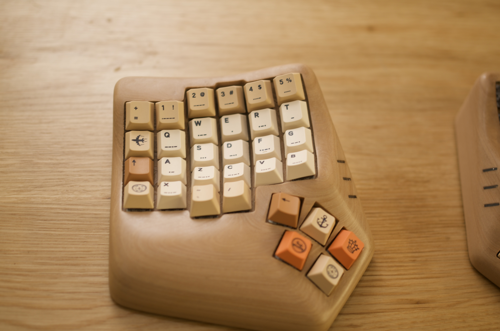
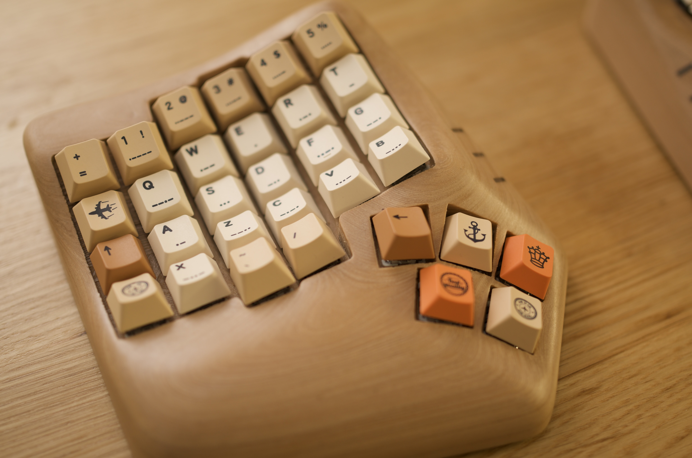
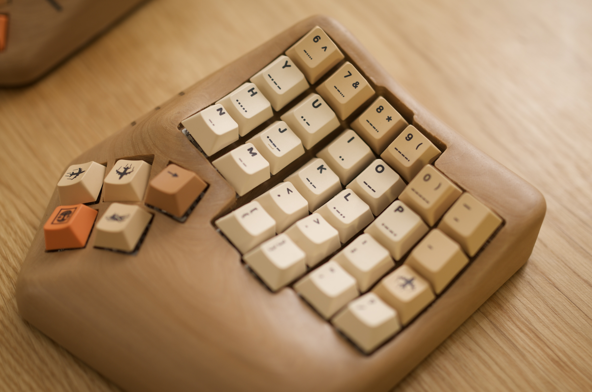
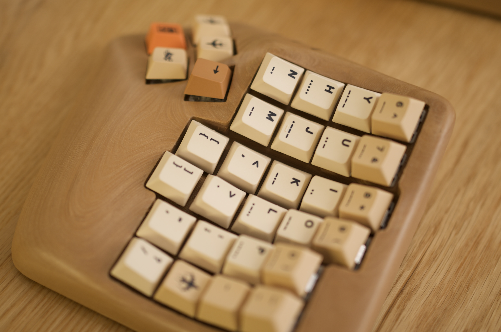
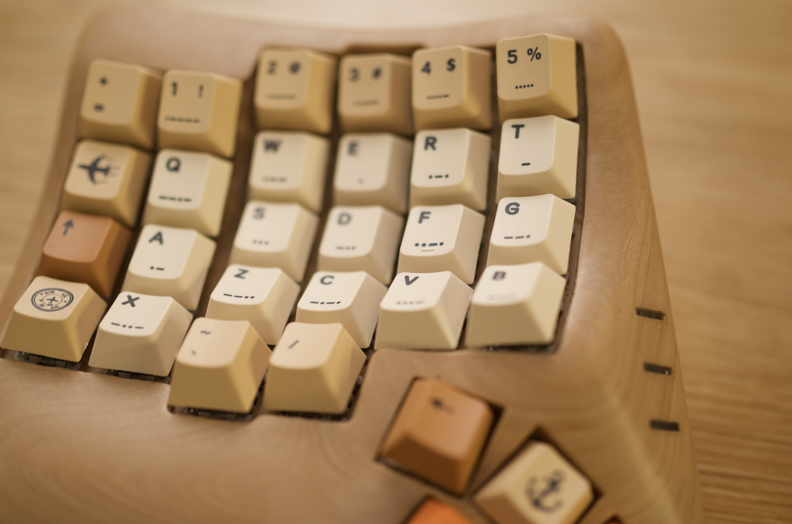
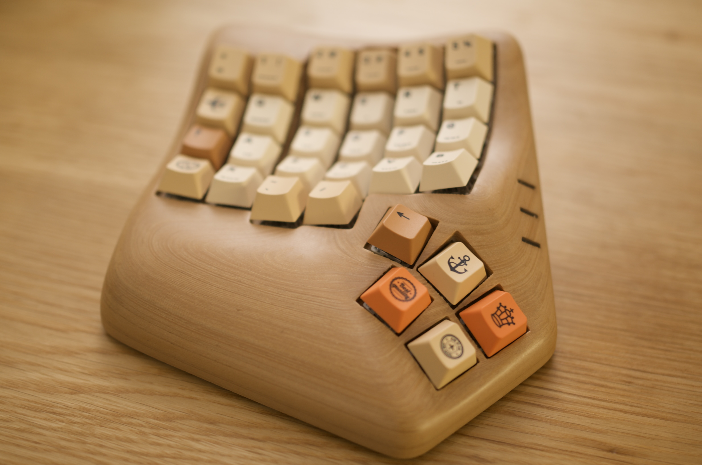
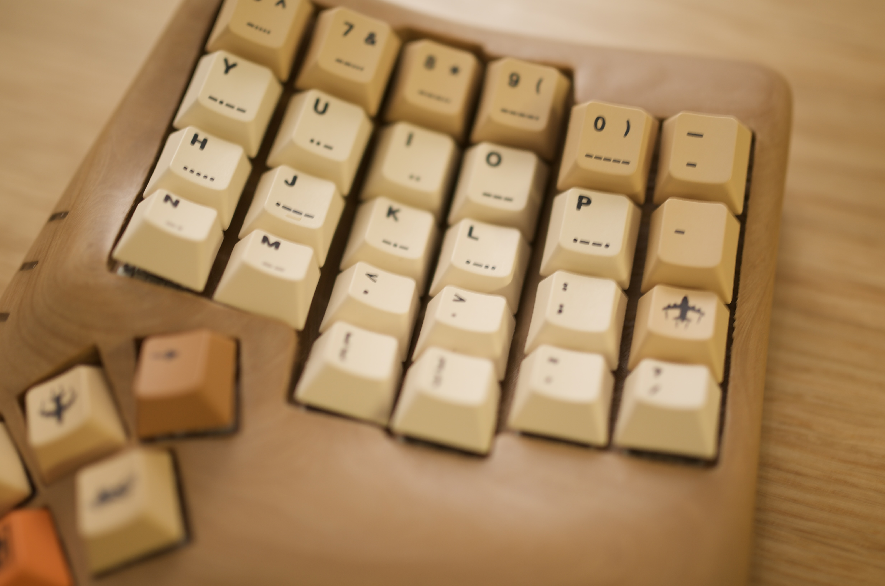
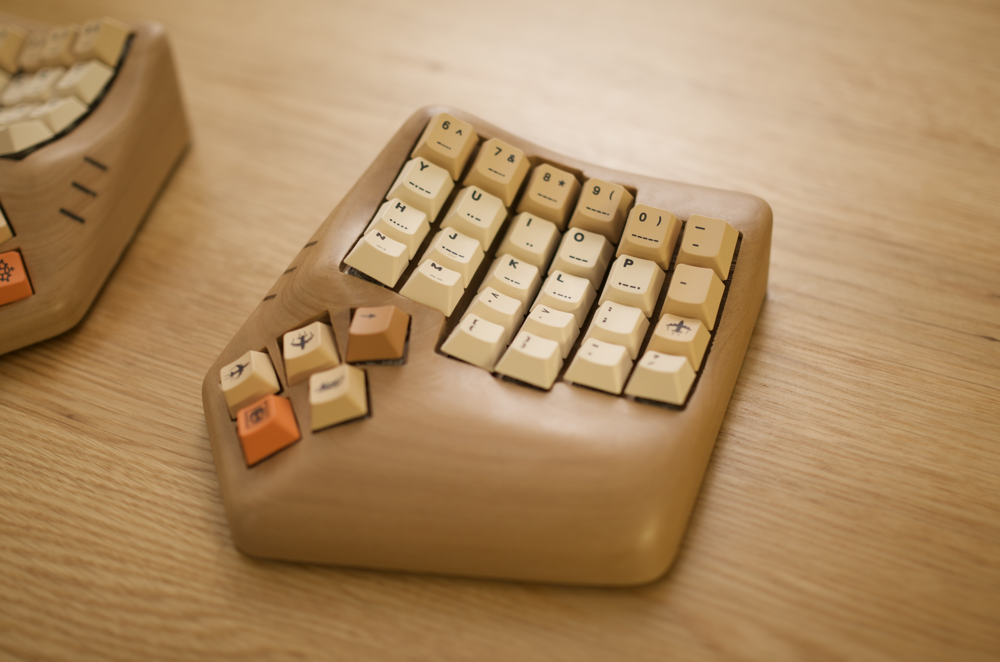
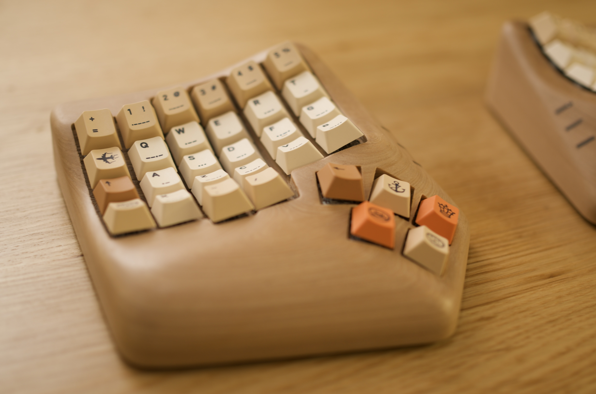
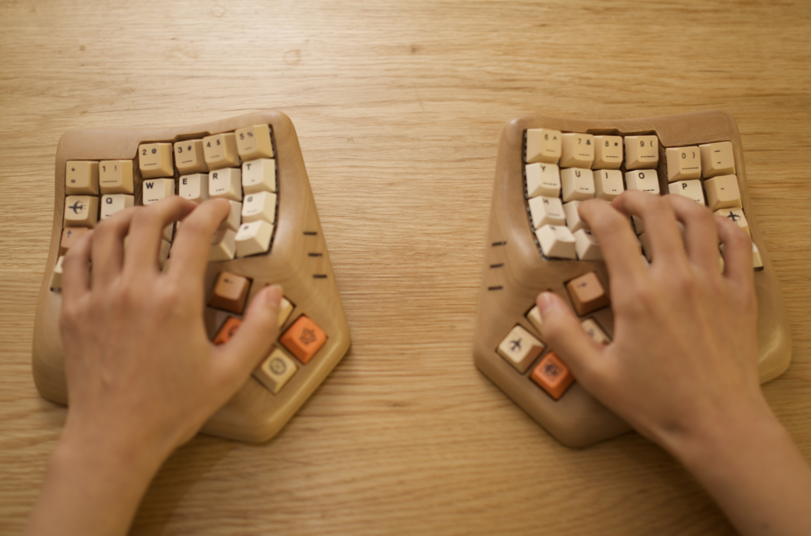

- [README 中文](./README-ZH.md)
- [README English](./README.md)
This repo will be abandoned, go to: https://github.com/egokb/zmk-config-ego46
# zmk-config-flkb
zmk config for FLKB  
keymap edit with https://nickcoutsos.github.io/keymap-editor/
discord:https://discord.gg/rwY3UyXv

## Instructions

1. Fork this repository.
2. Open url https://nickcoutsos.github.io/keymap-editor/, Login with your github account， Select the repository you just forked, And edit it.
3. Commit and push your changes to your personal repo. Upon pushing it, GitHub Actions will start building a new version of your firmware with the updated keymap.

## Firmware Files

To locate your firmware files...

1. Log into GitHub and navigate to your personal config repository you just uploaded your keymap changes to.
2. Click "Actions" in the main navigation, and in the left navigation click the "Build" link.
3. Select the desired workflow run in the centre area of the page (based on date and time of the build you wish to use). You can also start a new build from this page by clicking the "Run workflow" button.
4. After clicking the desired workflow run, you should be presented with a section at the bottom of the page called "Artifacts". This section contains the results of your build, in a file called "firmware.zip"
5. Download the firmware zip archive and extract the two `.uf2` files. They are named according to which side they need to be flashed to.
6. Flash the firmware to your keyboard by double-clicking the reset button to put the it in bootloader mode. A window should pop up showing the contents of the storage on the keyboard. Drag and drop the correct `.uf2` file into the window. When the upload is complete the window will close and the keyboard will exit bootloader mode.
    - If you only changed [the keymap file](/config/flkb.keymap) you only need to flash the left side firmware to the left side.
    - If you changed [the conf file](/config/flkb.conf) you should flash both sides their respective files.

Your keyboard is now ready to use.

